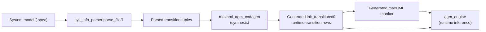
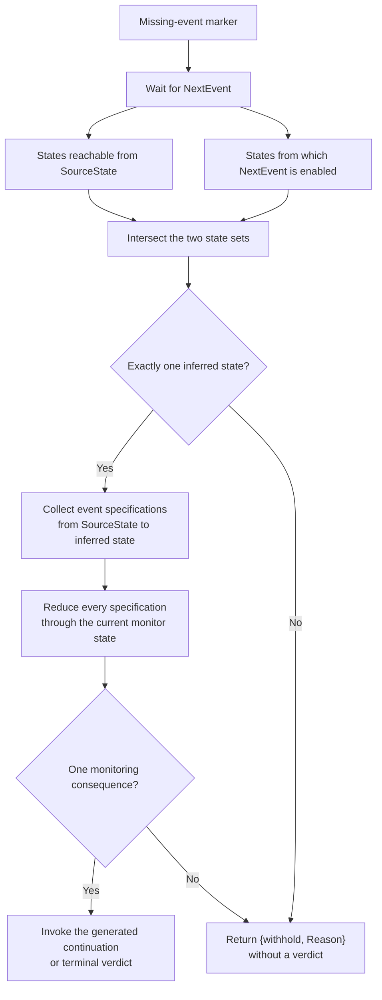

# Regeneration

This directory contains the system-model parser and the pure runtime engine used
for Automaton-Guided Monitoring (AGM). Together, they support sound monitoring
when a trace contains a missing event.

The central idea is to recover a uniquely determined system state first. The
exact missing event is optional: monitoring may continue whenever every event
compatible with that state transition has the same monitoring consequence.

## Modules

| Module | Responsibility |
| --- | --- |
| [`sys_info_parser.erl`](sys_info_parser.erl) | Parses a static system transition specification into Erlang terms at synthesis time. |
| [`agm_engine.erl`](agm_engine.erl) | Performs pure state inference, event-descriptor lookup, and monitoring-consequence resolution at runtime. |

Neither module generates monitor code. That responsibility belongs to
[`maxhml_agm_codegen.erl`](../synthesis/maxhml_agm_codegen.erl), which connects
the parsed model to the generated maxHML monitor.

## End-to-End Flow



## System Model Format

Each line in a `.spec` file represents one labelled transition:

```text
{SourceState, EventDescriptor, DestinationState};
```

For example:

```text
{START, NULL, s0};
{s0, 1, s1};
{s1, Z \ 0, s2};
```

The currently supported event descriptors are:

| Source notation | Meaning | Generated event specification |
| --- | --- | --- |
| `1`, `0`, `-1` | One concrete integer | `{literal, Integer}` |
| `event_name` | One concrete atom | `{literal, Atom}` |
| `NULL` | The atom `null` | `{literal, null}` |
| `N` | Any positive integer (`Event > 0`) | `{symbolic, natural_integer}` |
| `Z` | Any integer | `{symbolic, any_integer}` |
| `R` | Any Erlang number | `{symbolic, real_number}` |
| `Z \ 0` | Any integer except the stated integer | `{symbolic, any_integer_except, 0}` |

`sys_info_parser:parse_file/1` returns rows in source order as:

```erlang
{SourceState, ParsedEventDescriptor, DestinationState}
```

The synthesis code then turns each parsed row into the runtime representation:

```erlang
{
    SourceState,
    DestinationState,
    EventSpec,
    PredicateFun
}
```

`EventSpec` is inspectable metadata. `PredicateFun` decides whether a concrete
runtime event belongs to that event specification.

The parser currently supports one set-minus guard. Other combinations such as
unions and disjunctions are not implemented. Blank lines are not ignored.

## LTS Assumption

The supplied system model is expected to be a deterministic labelled
transition system: for a given source state and concrete event, at most one
destination state may be enabled. `agm_engine` relies on this precondition; it
does not validate determinism when loading transition rows.

Several event descriptors may still label the same source-to-destination pair.
This does not make state recovery ambiguous. Monitoring can proceed if all
those descriptors induce the same monitor continuation or verdict.

## `sys_info_parser`

### Public API

```erlang
sys_info_parser:parse_file(FilePath) -> ParsedTransitions
```

The parser:

1. Reads the complete `.spec` file.
2. Splits it into transition lines.
3. Parses source and destination states as atoms.
4. Parses concrete or symbolic event descriptors.
5. Returns transition tuples for synthesis.

Malformed or unsupported input currently fails during parsing; the function
does not return a structured validation error.

## `agm_engine`

`agm_engine` is deliberately pure. It does not receive trace messages, access
ETS, invoke monitor continuations, or emit verdicts. Those effects remain at
the generated-monitor boundary.

### Model Queries

| Function | Result |
| --- | --- |
| `get_system_states/1` | All distinct source and destination states. |
| `reachable_state/3` | The destination reached from a state by one concrete event, or `[]`. |
| `reachable_states_from_state/2` | All one-step destinations from a source state. |
| `preceding_states_from_state/2` | All one-step predecessors of a destination state. |
| `preceding_states_from_event/2` | All states from which a concrete event is enabled. |
| `candidate_event_specs/3` | Event specifications labelling one source-to-destination pair. |
| `event_spec_membership/2` | Whether a concrete value belongs to an event specification. |

### Recovery and Consequence Resolution

| Function | Result |
| --- | --- |
| `resolve_singleton_state/1` | Accepts exactly one candidate state; otherwise withholds. |
| `recover_missing_event/3` | Infers the state reached by the missing event using the previous state and next observed event. |
| `resolve_monitoring_consequence/2` | Proceeds only when all candidate event specifications reduce to one monitor consequence. |

Successful state recovery has this shape:

```erlang
{ok, #{
    source_state => SourceState,
    inferred_state => InferredState,
    event_specs => EventSpecs
}}
```

Successful consequence resolution has this shape:

```erlang
{ok, #{
    consequence => {verdict, yes | no} | {continue, Function, Arguments},
    event => {known, Event} | unknown,
    continuation => Continuation
}}
```

The `event` field is `{known, Event}` only when one literal event is uniquely
identified. An `unknown` event does not prevent monitoring when the consequence
is nevertheless unique.

## Missing-Event Recovery

Let `SourceState` be the last known state and `NextEvent` the first observed
event after the missing position.



State recovery can withhold with:

| Reason | Meaning |
| --- | --- |
| `impossible_recovery` | No state is compatible with both sides of the missing position. |
| `ambiguous_state` | More than one state is compatible with both sides. |

Consequence resolution can additionally withhold with:

| Reason | Meaning |
| --- | --- |
| `ambiguous_consequence` | Candidate events lead to different monitor continuations or verdicts. |
| `unproven_consequence` | The generated reducer cannot prove a uniform consequence for a symbolic event set. |

Withholding is not a verdict. It prevents the monitor from guessing when the
available evidence is insufficient.

## Tests

From the inner `detecter` directory:

```sh
make test
```

The relevant suites are:

| Test module | Coverage |
| --- | --- |
| [`sys_info_parser_test.erl`](../../test/regeneration/sys_info_parser_test.erl) | Concrete, symbolic, `NULL`, and set-minus parsing. |
| [`agm_engine_test.erl`](../../test/regeneration/agm_engine_test.erl) | Pure state inference and consequence resolution. |
| [`generated_monitor_smoke_test.erl`](../../test/regeneration/generated_monitor_smoke_test.erl) | Synthesis and compilation of representative generated monitors. |
| [`generated_agm_recovery_test.erl`](../../test/regeneration/generated_agm_recovery_test.erl) | End-to-end generated-monitor recovery and withholding behavior. |
