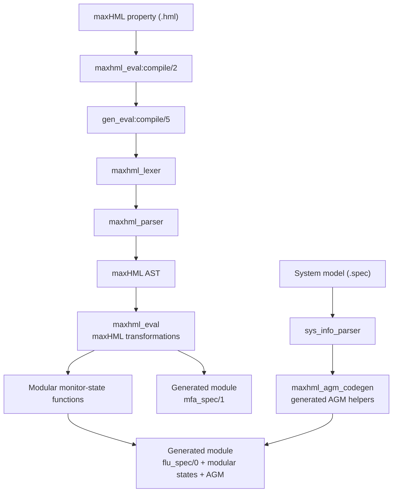
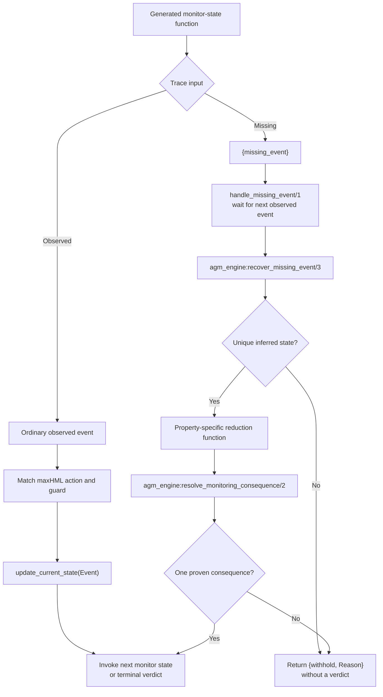

# maxHML Synthesis Workflow

## Scope

This README documents only the maxHML synthesis workflow and its current
Automaton-Guided Monitoring (AGM) integration.

The other specification languages and synthesis utilities in this directory
are intentionally not documented here. In particular, this guide does not
describe the linear/session-language tooling or its instrumentation workflow.

## Purpose

The maxHML compiler translates a `.hml` property into modular Erlang monitor
states. Each relevant formula construct becomes a generated function rather
than being permanently enclosed inside one monolithic continuation. The
generated monitor can therefore call external runtime machinery, including the
AGM engine used to infer states around missing events.

The current split is:

- `maxhml_eval` understands maxHML and builds modular monitor states.
- `maxhml_agm_codegen` generates maxHML-specific AGM support code.
- `gen_eval` provides the shared parse, module-assembly, and output pipeline.
- `agm_engine`, in `../regeneration`, performs pure runtime inference.

## Files in the Workflow

| File | Responsibility |
| --- | --- |
| [`maxhml_eval.erl`](maxhml_eval.erl) | Public maxHML compiler entry point, formula traversal, modular monitor-state generation, variable flow, and AGM callback delegation. |
| [`maxhml_agm_codegen.erl`](maxhml_agm_codegen.erl) | Erlang AST generation for model rows, state management, missing-event handling, and property-specific consequence reducers. |
| [`gen_eval.erl`](gen_eval.erl) | Shared compiler pipeline: parse a property, assemble generated modules, and write Erlang source or BEAM output. |
| [`maxhml_lexer.erl`](maxhml_lexer.erl) | Generated lexer used by `maxhml_eval`. |
| [`maxhml_parser.erl`](maxhml_parser.erl) | Generated parser that produces the maxHML abstract syntax tree. |
| [`maxhml_lexer.xrl`](../../priv/maxhml_lexer.xrl) | Source lexer specification. Change this rather than editing the generated lexer directly. |
| [`maxhml_parser.yrl`](../../priv/maxhml_parser.yrl) | Source grammar specification. Change this rather than editing the generated parser directly. |
| [`agm_engine.erl`](../regeneration/agm_engine.erl) | Pure runtime state-recovery and consequence-resolution engine called by generated monitors. |

## Synthesis Flow

The public entry point is:

```erlang
maxhml_eval:compile(PropertyFile, Options).
```



`gen_eval` currently emits two modules for one property:

1. `<property>` exposes `mfa_spec/1`.
2. `<property>_flu` exposes `flu_spec/0` and contains the modular monitor-state
   functions, verdict functions, transition rows, state management, and AGM
   helpers.

With the `erl` option, these are written as `.erl` source files. Without it,
the compiler writes BEAM output.

## Compiler Responsibilities

### `maxhml_eval`

`maxhml_eval` implements the maxHML-specific callbacks used by `gen_eval`.
Its main responsibilities are:

1. Delegate lexical analysis and parsing to the maxHML lexer and parser.
2. Traverse the maxHML AST.
3. Generate a named Erlang function for each modular monitor state.
4. Carry variables needed by later formula states as function arguments.
5. Generate normal-event receive clauses and state-update calls.
6. Add a missing-event clause to monitor states that support AGM recovery.
7. Delegate AGM helper generation to `maxhml_agm_codegen`.

At a high level, terminal `tt` and `ff` formulae become irrevocable `yes` and
`no` verdict functions. Necessities and supported conjunctions become receive
states whose matching clauses call the next generated function. Maximal
fixpoints and formula variables provide named recursion between those states.

### `gen_eval`

`gen_eval` owns the language-independent compiler shell. For maxHML it:

1. Calls `maxhml_lexer` and `maxhml_parser`.
2. Asks `maxhml_eval` to generate entry, state, and verdict forms.
3. Calls the AGM-generation callbacks when assembling the `_flu` module.
4. Lints and writes the generated Erlang module or compiles it to BEAM.

The AGM callbacks are:

```erlang
generate_sys_info_function/1
generate_all_states/0
generate_state_management/0
agm_generation/0
```

`maxhml_eval` keeps these callbacks for the `gen_eval` behavior, but their
implementations delegate directly to `maxhml_agm_codegen`.

### `maxhml_agm_codegen`

This module operates at synthesis time and produces Erlang syntax trees. It
generates:

- `init_transitions/0`, containing model-specific runtime transition rows.
- Adapters from generated monitor helpers to `agm_engine`.
- ETS-backed `update_current_state/1`.
- `handle_missing_event/1`, which waits for the next observed event and invokes
  state recovery.
- A property-specific reduction function for deciding the monitoring
  consequence of candidate missing events.
- Missing-event control flow that invokes a continuation only after both state
  and consequence resolution succeed.

It does not itself infer runtime states. Generic inference is kept in
`agm_engine`.

## Runtime Flow

After synthesis, the generated `_flu` monitor handles ordinary and missing
events differently:



The generated monitor owns runtime effects:

- receiving the lookahead trace event;
- reading and updating the `sus_state` ETS table;
- invoking the selected continuation;
- emitting a terminal verdict.

The AGM engine remains pure and returns data describing either a justified
result or a reason to withhold.

## Monitoring Consequence

Recovery does not require the exact missing event. It requires:

1. A unique state after the missing event.
2. One proven monitoring consequence across every event descriptor that could
   have caused that state transition.

A monitoring consequence is either:

```erlang
{verdict, yes | no}
```

or:

```erlang
{continue, GeneratedFunction, Arguments}
```

If several concrete or symbolic event candidates all yield the same
consequence, monitoring proceeds even when the exact event remains unknown.
If they disagree, or symbolic uniformity cannot be proved, the monitor
withholds instead of guessing.

The current generated reducer proves symbolic uniformity only for supported
monitor shapes. These require necessity branches with one action type and one
state-update event argument. Supported symbolic cases include event-independent
continuations and the implemented complementary equality/inequality guards.
Other shapes produce an unknown reduction and therefore withhold.

## Soundness Boundary

The implementation preserves the intended conservative boundary as follows:

- The system model is assumed to be a deterministic labelled transition
  system.
- State recovery succeeds only for one compatible inferred state.
- A continuation or verdict is selected only when all candidate events have
  one proven consequence.
- Exact event recovery is optional metadata, not a precondition for a verdict.
- Failed, ambiguous, or unsupported inference returns `{withhold, Reason}`.
- `withhold` is not a verdict and does not claim that the property is satisfied
  or violated.

This architecture supports the research claim by using deterministic state
inference and consequence agreement, rather than probabilistic approximation.

## Compile an Example

Compile the project first:

```sh
make compile
mkdir -p /tmp/detecter-maxhml
erl -pa ebin
```

Then, in the Erlang shell:

```erlang
maxhml_eval:compile(
    "test/props/prop_no_failure.hml",
    [
        {outdir, "/tmp/detecter-maxhml"},
        {mtab, "priv/sys_info.spec"},
        erl
    ]
).
```

The `mtab` option supplies the static system model. The `erl` option keeps the
generated Erlang source visible for inspection.

## Tests

Run the complete default suite from the inner `detecter` directory:

```sh
make test
```

The most relevant tests are:

| Test module | Coverage |
| --- | --- |
| [`generated_monitor_smoke_test.erl`](../../test/regeneration/generated_monitor_smoke_test.erl) | Representative maxHML synthesis and generated-source compilation. |
| [`generated_agm_recovery_test.erl`](../../test/regeneration/generated_agm_recovery_test.erl) | Runtime recovery, consequence agreement, withholding, and generated engine dependency. |
| [`agm_engine_test.erl`](../../test/regeneration/agm_engine_test.erl) | Pure AGM behavior independently of generated monitor effects. |

When changing maxHML syntax, edit the `.xrl` or `.yrl` source and regenerate the
corresponding lexer or parser rather than modifying generated files by hand.
